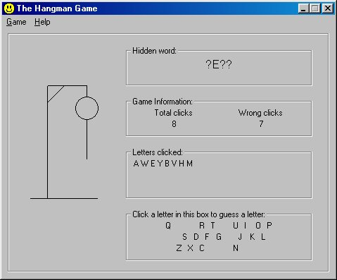



## A VERY Good Hangman Game

### Description

Great for advanced or beginer Visual Basic users. Demonstrates how to include a "registration key" for trial version software, read and write the registry, make a game of hangman, read and write from files, clickable letters, pick a random word from a list of words in a file, choose a word for another player, add word to the word list, worth a look, PLEASE RANK!!

Cipher Software,

ciphersoftware@hotmail.com, www,ciphersoftware.cjb.net
 
### More Info
 
read from the registry and files

registeration key: RFfrJ-EqaTr-G31EP-ISdfL-TIh5Q

its in the code, but just in case

write to the registry and files

             |
---                |---
**Submitted On**   |2000-10-16 17:26:54
**By**             |[Scott Quinlan](https://github.com/Planet-Source-Code/PSCIndex/blob/master/ByAuthor/scott-quinlan.md)
**Level**          |Advanced
**User Rating**    |4.7 (28 globes from 6 users)
**Compatibility**  |VB 6\.0
**Category**       |[Games](https://github.com/Planet-Source-Code/PSCIndex/blob/master/ByCategory/games__1-38.md)
**World**          |[Visual Basic](https://github.com/Planet-Source-Code/PSCIndex/blob/master/ByWorld/visual-basic.md)
**Archive File**   |[CODE\_UPLOAD1153611102000\.zip](https://github.com/Planet-Source-Code/scott-quinlan-a-very-good-hangman-game__1-12659/archive/master.zip)

